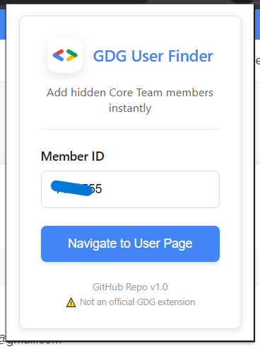
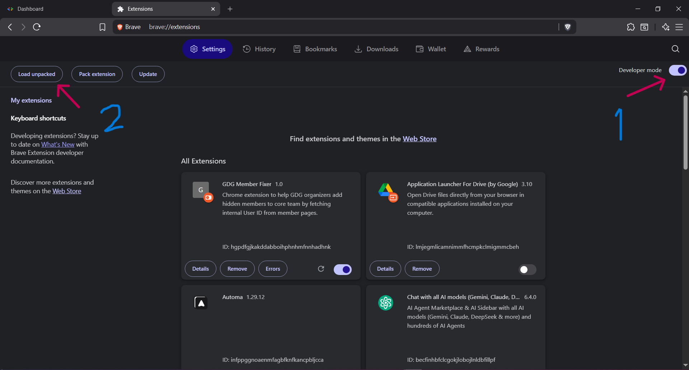
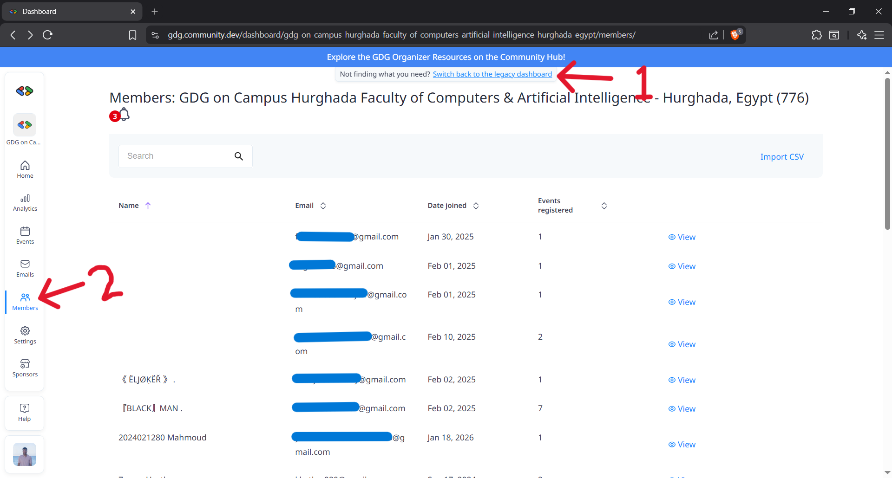
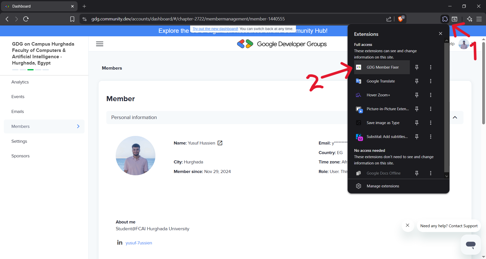
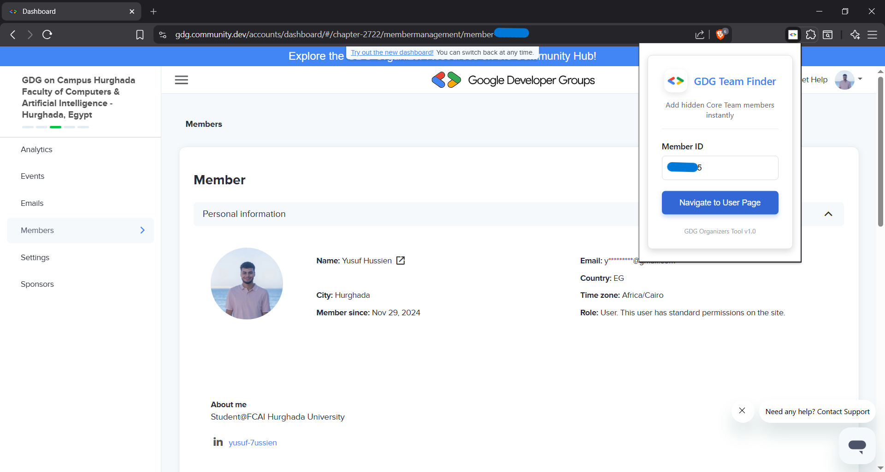

# GDG User Finder Extension

> **⚠️ Caution**: This is **not an official GDG extension**. It's a community-developed tool created by GDG organizers to solve a specific workflow challenge.

A Chrome extension designed to help GDG organizers efficiently add hidden members to their core team by fetching internal User IDs from member pages.

## 🚨 Problem Statement

As GDG on Campus Organizers, we faced a significant problem while adding our team members to the chapter page due to the poor manual process. The traditional method required:

- Manual navigation through multiple pages
- Complex URL manipulation
- Technical knowledge of GDG's internal API structure
- Average time cost: **~90 seconds per member**

This inefficiency was consuming valuable organizer time and creating barriers to team management.

## ✅ Solution

We developed the GDG Member Finder extension to solve these challenges by:

- **Automating the User ID discovery process**
- **Eliminating manual URL manipulation**
- **Removing the need for technical API knowledge**
- **Reducing time cost from ~90 seconds to ~5 seconds per member**

## 📸 Extension Preview

### Widget View

### Full Page View

## 🛠️ Installation Guide

> **Note**: This extension is not published to Chrome Web Store due to publishing fees. Please install it locally using the steps below.

### Local Installation Steps

1. **Download the Extension**
   - Clone or download this repository to your local machine

2. **Open Chrome Extensions**
   - Navigate to `chrome://extensions/` in your Chrome browser
   - Enable "Developer mode" using the toggle in the top-right corner
   
   

3. **Load the Extension**
   - Click on "Load unpacked"
   - Select the downloaded extension folder
   - The extension will appear in your extensions list and browser toolbar

## 📖 User Manual

### Step 1: Access Admin Dashboard
After logging into your GDG account:
- Open the admin dashboard
- Switch to the legacy board as shown by the first arrow
- Navigate to the members table

### Step 2: Find Member & Open Extension
- Search for the member you need by name or email
- Click on that user to navigate to their page
- Open the extensions menu and select "GDG Member Finder"

### Step 3: Use the Extension
- The extension will auto-detect the Member ID from the current URL
- Press the "Navigate to User Page" button

### Step 4: Add Core Team Member
- You'll be automatically navigated to the "Add Core Team Member" page
- Simply assign the member's role and save
- You're done! The member is now added to your core team

## 🎯 Key Features

- **Auto-detection**: Automatically extracts Member ID from current URL
- **Time Efficient**: Reduces process time from 90s to 5s
- **User-Friendly**: No technical knowledge required
- **GDG Theme**: Matches official GDG website design
- **Error Handling**: Clear feedback for common issues

## 🔧 Technical Details

### How It Works
1. Extracts Chapter ID and Member ID from current page URL
2. Calls GDG's internal API: `https://gdg.community.dev/api/chapter/{chapterId}/member/{memberId}`
3. Retrieves the hidden User ID from API response
4. Navigates to: `https://gdg.community.dev/accounts/dashboard/#/chapter-{chapterId}/settings/newmember-{userId}`

### Permissions
- `activeTab`: Access current tab information
- `scripting`: Execute content scripts
- `https://gdg.community.dev/*`: Access GDG domains

## 👥 Contributors

- **Omar El Khashab** - [Omaraldin](https://github.com/Omaraldin)
- **Mohamed Abdulrhim** - [Vlhoseny](https://github.com/Vlhoseny)
- **Yusuf Hussien** - [Yusuf-Hussien](https://github.com/Yusuf-Hussien)

## 📄 License

This project is open source and available under the MIT License.

## 🤝 Contributing

We welcome contributions! Please feel free to submit issues and enhancement requests.

## 📞 Support

For support or questions, please open an issue in the GitHub repository.

---

**GDG Member Finder** - Making team management efficient for GDG organizers worldwide! 🚀
